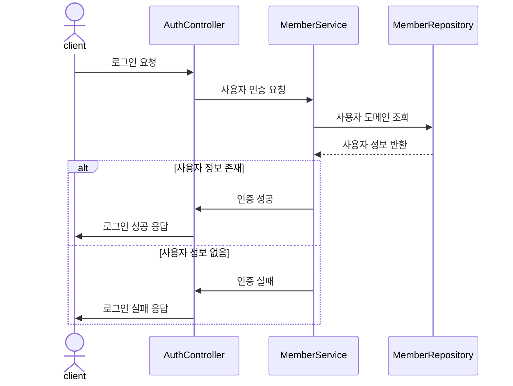

# Sequence Diagram

## Login

```mermaid
sequenceDiagram
    actor A as client
    participant AuthController
    participant MemberService
    participant MemberRepository
    A ->> AuthController: 로그인 요청
    AuthController ->> MemberService: 사용자 인증 요청
    MemberService ->> MemberRepository: 사용자 도메인 조회
    MemberRepository -->> MemberService: 사용자 정보 반환
    alt 사용자 정보 존재
        MemberService ->> AuthController: 인증 성공
        AuthController ->> A: 로그인 성공 응답
    else 사용자 정보 없음
        MemberService ->> AuthController: 인증 실패
        AuthController ->> A: 로그인 실패 응답
    end
```
